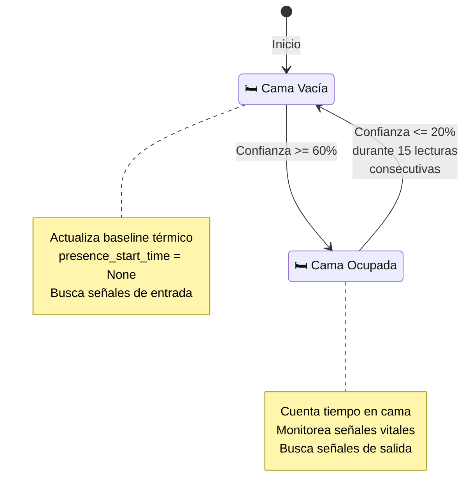
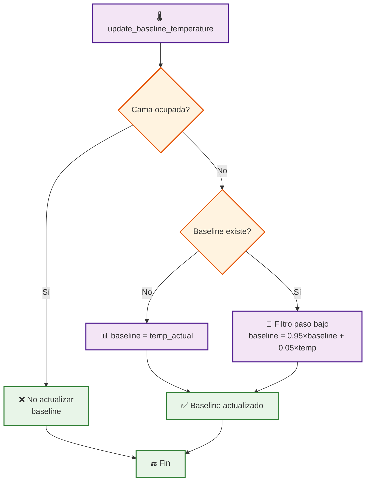

# 🛏️ Diagrama de Flujo - Detector de Presencia en Cama

## 📊 Flujo Principal del Sistema

```mermaid
flowchart TD
    START([🚀 INICIO]) --> INIT[📋 Inicializar Variables<br/>bed_occupied = False<br/>presence_confidence = 0<br/>baseline_temperature = None<br/>presence_history = lista vacía]
    
    INIT --> DETECT[🔍 detect_presence]
    
    DETECT --> GET_DATA[📡 Obtener Datos de Sensores<br/>bed_temperature<br/>activity<br/>heart_rate<br/>hr_valid<br/>finger_present]
    
    GET_DATA --> CHECK_BASELINE{🌡️ Baseline<br/>establecido?}
    CHECK_BASELINE -->|No| SET_BASELINE[📊 Establecer baseline_temperature<br/>= bed_temperature]
    CHECK_BASELINE -->|Sí| ANALYZE
    SET_BASELINE --> ANALYZE
    
    ANALYZE[🧠 Analizar 5 Indicadores] --> THERMAL[🌡️ INDICADOR TÉRMICO]
    
    THERMAL --> TEMP_CHECK{Elevación temp ><br/>threshold?}
    TEMP_CHECK -->|Sí| TEMP_SCORE[+30 puntos<br/>+10 bonus si muy alta]
    TEMP_CHECK -->|No| MOVEMENT
    TEMP_SCORE --> MOVEMENT
    
    MOVEMENT[🏃 INDICADOR MOVIMIENTO] --> ACTIVITY_CHECK{Actividad ><br/>threshold?}
    ACTIVITY_CHECK -->|Sí| ACTIVITY_SCORE[+0 a 25 puntos<br/>según nivel]
    ACTIVITY_CHECK -->|No| CARDIOVASCULAR
    ACTIVITY_SCORE --> CARDIOVASCULAR
    
    CARDIOVASCULAR[❤️ INDICADOR CARDIOVASCULAR] --> HR_CHECK{HR válida y<br/>en rango 40-150?}
    HR_CHECK -->|Sí| HR_SCORE[+35 puntos<br/>+5 bonus 50-80 BPM]
    HR_CHECK -->|No| CONTACT
    HR_SCORE --> CONTACT
    
    CONTACT[👆 INDICADOR CONTACTO] --> FINGER_CHECK{Dedo presente<br/>en MAX30102?}
    FINGER_CHECK -->|Sí| FINGER_SCORE[+20 puntos]
    FINGER_CHECK -->|No| TEMPORAL
    FINGER_SCORE --> TEMPORAL
    
    TEMPORAL[⏰ INDICADOR TEMPORAL] --> HISTORY_CHECK{Confianza promedio<br/>últimas 5 lecturas > 50%?}
    HISTORY_CHECK -->|Sí| TEMPORAL_SCORE[+10 puntos]
    HISTORY_CHECK -->|No| CALCULATE
    TEMPORAL_SCORE --> CALCULATE
    
    CALCULATE[🧮 Calcular Confianza Total<br/>confidence = min suma_puntos 100] --> UPDATE_STATE[🔄 update_presence_state]
    
    UPDATE_STATE --> OCCUPIED_CHECK{Cama<br/>ocupada?}
    
    OCCUPIED_CHECK -->|No| ENTRY_CHECK{Confianza >=<br/>umbral_entrada?}
    ENTRY_CHECK -->|Sí| ENTER[✅ PRESENCIA DETECTADA<br/>bed_occupied = True<br/>presence_start_time = now<br/>presence_changed = True]
    ENTRY_CHECK -->|No| RETURN_RESULT
    
    OCCUPIED_CHECK -->|Sí| EXIT_CHECK{Confianza <=<br/>umbral_salida?}
    EXIT_CHECK -->|Sí| CONFIRM_EXIT{Últimas 15 lecturas<br/>< 30% confianza?}
    EXIT_CHECK -->|No| RETURN_RESULT
    
    CONFIRM_EXIT -->|Sí| EXIT[❌ AUSENCIA DETECTADA<br/>bed_occupied = False<br/>presence_start_time = None<br/>presence_changed = True]
    CONFIRM_EXIT -->|No| RETURN_RESULT
    
    ENTER --> RETURN_RESULT
    EXIT --> RETURN_RESULT
    
    RETURN_RESULT[📤 Retornar Resultado<br/>occupied<br/>confidence<br/>indicators<br/>time_occupied<br/>temp_elevation<br/>presence_changed] --> END([🏁 FIN])

    %% Estilos
    classDef startEnd fill:#e1f5fe,stroke:#01579b,stroke-width:2px
    classDef process fill:#f3e5f5,stroke:#4a148c,stroke-width:2px
    classDef decision fill:#fff3e0,stroke:#e65100,stroke-width:2px
    classDef score fill:#e8f5e8,stroke:#2e7d32,stroke-width:2px
    classDef indicator fill:#fff8e1,stroke:#f57f17,stroke-width:2px
    
    class START,END startEnd
    class INIT,GET_DATA,ANALYZE,CALCULATE,UPDATE_STATE,ENTER,EXIT,RETURN_RESULT process
    class CHECK_BASELINE,TEMP_CHECK,ACTIVITY_CHECK,HR_CHECK,FINGER_CHECK,HISTORY_CHECK,OCCUPIED_CHECK,ENTRY_CHECK,EXIT_CHECK,CONFIRM_EXIT decision
    class TEMP_SCORE,ACTIVITY_SCORE,HR_SCORE,FINGER_SCORE,TEMPORAL_SCORE,SET_BASELINE score
    class THERMAL,MOVEMENT,CARDIOVASCULAR,CONTACT,TEMPORAL indicator
```



## 🎯 Sistema de Puntuación Detallado

### 📊 5 Indicadores de Presencia:

| Indicador | Condición | Puntos | Bonus |
|-----------|-----------|--------|-------|
| 🌡️ **Térmico** | Temp > baseline + 1.5°C | +30 | +10 si muy alta |
| 🏃 **Movimiento** | Actividad > 0.001 | 0-25 | Escalado por nivel |
| ❤️ **Cardiovascular** | HR válida 40-150 BPM | +35 | +5 si 50-80 BPM |
| 👆 **Contacto** | Dedo en MAX30102 | +20 | - |
| ⏰ **Temporal** | Promedio 5 lecturas > 50% | +10 | - |

**Total máximo:** 100 puntos

## 🔄 Histéresis de Estados



## 🌡️ Gestión de Baseline Térmico



## 🔧 Funciones Auxiliares

### 📋 get_presence_summary()
- Retorna estado actual completo
- Tiempo en cama
- Confianza actual
- Baseline térmico

### 🔄 reset_presence_state()
- Resetea todas las variables
- Limpia historial
- Estado inicial

### 🔍 get_detailed_indicators()
- Análisis detallado por indicador
- Valores vs umbrales
- Útil para debugging

### 📊 calibrate_baseline()
- Calibración con múltiples lecturas
- Usa mediana para evitar outliers
- Recomendado 5 minutos de datos

## 📈 Configuración de Umbrales

```yaml
PRESENCIA:
  umbral_entrada: 60%      # Para detectar presencia
  umbral_salida: 20%       # Para detectar ausencia
  confirmacion: 15 lecturas # Lecturas para confirmar salida
  
SENSORES:
  termico: +1.5°C         # Elevación sobre baseline
  actividad: 0.001        # Nivel mínimo movimiento
  hr_min: 40 BPM          # HR mínima válida
  hr_max: 150 BPM         # HR máxima válida
  
HISTORIAL:
  tamaño: 30 lecturas     # Ventana temporal
  suavizado: 0.05         # Factor filtro baseline
```

## 🎯 Casos de Uso Típicos

1. **Entrada a la cama:**
   - Temperatura sube > +1.5°C
   - Movimiento detectado
   - HR válida presente
   - Confianza alcanza 60%

2. **Durante el sueño:**
   - Temperatura mantenida alta
   - Movimiento mínimo
   - HR estable en rango
   - Contacto intermitente

3. **Salida de la cama:**
   - Temperatura desciende
   - Sin movimiento
   - HR inválida
   - Sin contacto
   - Confianza ≤ 20% durante 15 lecturas

Este sistema de fusión multi-sensor proporciona detección robusta y confiable de presencia en la cama inteligente! 🛏️✨
